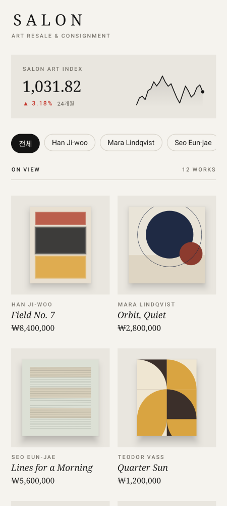
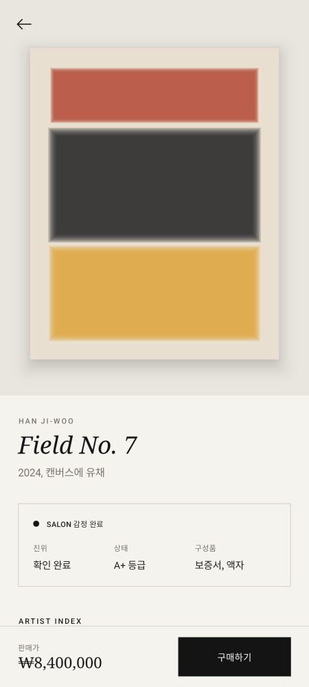
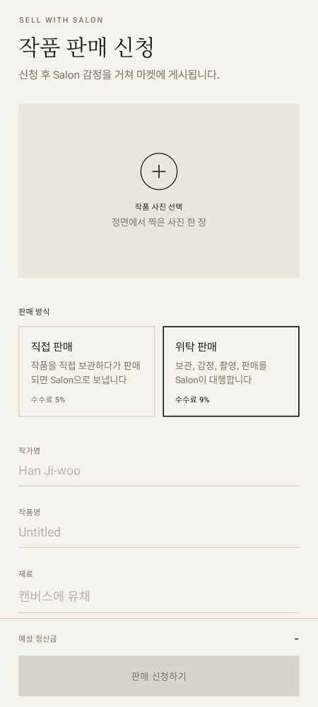
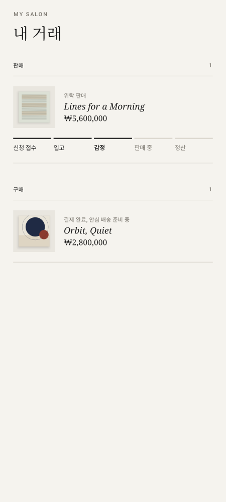

# Salon

미술품 리셀과 위탁 판매를 중개하는 안드로이드 앱 목업입니다. 바이버의 판매 구조(직접 판매, 위탁 판매, 감정, 시세 인덱스)를 미술품에 옮겼습니다.
서버 없이 메모리 목업으로 동작하며, 앱을 다시 켜면 초기 데이터로 돌아갑니다.

| 마켓 | 작품 상세 | 판매 신청 | 내 거래 |
|---|---|---|---|
|  |  |  |  |

## 기능
- 마켓: Salon Art Index, 작가 필터, 판매 중 작품 그리드
- 상세: Salon 감정 리포트, 작가 호당 시세 그래프, 거래 안내, 목업 결제
- 판매: 사진 선택, 직접 판매와 위탁 판매 선택, 예상 정산금 계산
- 내 거래: 판매 진행 단계, 구매 내역

## 목업 동작
- 작품 이미지는 Canvas로 그린 추상화입니다. 이미지 파일과 네트워크가 필요 없습니다
- 판매 신청 후 3초마다 단계가 넘어가 판매 중이 되면 마켓에 올라옵니다
- 시세와 지수는 시드를 고정한 난수 곡선입니다

## 빌드
- Android Studio에서 `art-salon` 폴더를 열고 실행합니다
- 명령줄은 `./gradlew assembleDebug`이며 결과물은 `app/build/outputs/apk/debug/app-debug.apk`입니다
- 요구사항: JDK 17 이상, Android SDK 35, minSdk 26

## 구조
| 경로 | 역할 |
|---|---|
| `data/` | 작품 모델, 목업 작품, 시세 목업 |
| `SalonViewModel.kt` | 메모리 저장소, 구매와 판매 신청 처리 |
| `ui/SalonApp.kt` | 탭과 상세 화면 전환 |
| `ui/*Screen.kt` | 마켓, 상세, 판매, 내 거래 화면 |
| `ui/GenerativeArt.kt` | 목업 작품 렌더링 |
